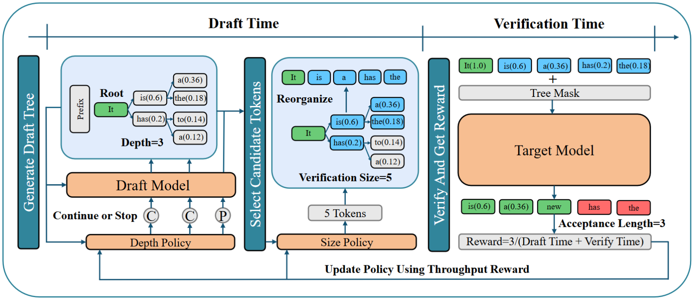
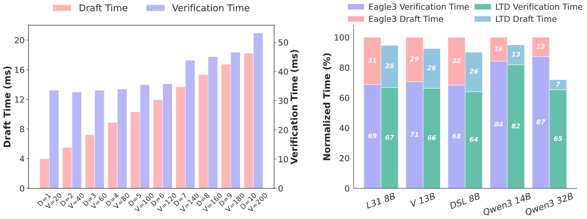

# LEARNING TO DRAFT: ADAPTIVE SPECULATIVE DECODING WITH REINFORCEMENT LEARNING

This is the official implementation of "Learning To Draft: Adaptive Speculative Decoding with Reinforcement Learning" (ICLR 2026).  We introduce Learning to Draft (LTD), a novel method that directly
optimizes for throughput of each draft-and-verify cycle in speculative decoding. We formulate the problem
as a reinforcement learning environment and train two co-adaptive policies to
dynamically coordinate the draft and verification phases. This encourages the
policies to adapt to each other and explicitly maximize decoding efficiency. 

<p align="center">
     <br>
</p>

## Highlight Results

During greedy decoding, LTD yields substantial throughput
improvements over the highly optimized Eagle3 baseline: 36.4% on Qwen3-32B, 9.5% on DeepseekDistilled-Llama-8B, 6.5% on Llama-3-8B, 5% on Vicuna-1.3-13B, and 4% on Qwen3-14B. 

<p align="center">
     <br>
</p>

## Setup & Installation

```python
git clone https://github.com/zhzihao/Learning-to-Draft.git
cd Learning-to-Draft
python -m venv ~/venvs/ea_env
source ~/venvs/ea_env/bin/activate
pip install -r requirements.txt
```

## Train Policy 

```bash
export CUDA_VISIBLE_DEVICES=$1

# Model Paths
base_model_path="meta-llama/Llama-3.1-8B-Instruct"
ea_model_path="yuhuili/EAGLE3-LLaMA3.1-Instruct-8B"
rl_token_model_path="" # Leave empty to use default 60 tokens
rl_checkpoint_path=""  # Leave empty to start from scratch

# Data and Save Directories
data_dir="./eagle/data"
dataset_train="humaneval"
save_path="./checkpoints"

# RL Hyperparameters
total_timesteps=100000
batch_size=64
n_steps=128
lr=3e-4

python3 -m rl.rl_depth \
    --base_model_path ${base_model_path} \
    --ea_model_path ${ea_model_path} \
    --rl_token_model_path "${rl_token_model_path}" \
    --rl_checkpoint_path "${rl_checkpoint_path}" \
    --data_dir ${data_dir} \
    --dataset_train ${dataset_train} \
    --save_path ${save_path} \
    --total_timesteps ${total_timesteps} \
    --batch_size ${batch_size} \
    --n_steps ${n_steps} \
    --lr ${lr} \
    --pi_arch 512 256 \
    --vf_arch 1024 512
```

### 1. Model & Path Configurations

* **`--base_model_path`**: Path to your base Large Language Model (e.g., LLaMA-3). 
* **`--ea_model_path`**: Path to your EAGLE draft model. 
* **`--rl_token_model_path`**: Path to a pre-trained RL token model `.zip` file.
  * *Usage*: If provided, the environment will use this model to dynamically predict the `total_tokens_to_select`. If left empty (`""`), it defaults to a fixed size of 60 tokens.
* **`--rl_checkpoint_path`**: Path to an existing RL checkpoint to resume training.
  * *Usage*: If you want to continue training from a previous state, provide the `.zip` path. If left empty, a fresh PPO model will be initialized.
* **`--data_dir`**: Base directory where your datasets are stored.
* **`--save_path`**: Directory to save the trained models, checkpoints, and TensorBoard logs.

### 2. Dataset Configurations

* **`--dataset_train`**: The specific dataset to use for training (e.g., `humaneval`). The script expects the data to be located at `{data_dir}/{dataset_train}/question.jsonl`.

### 3. PPO Hyperparameters

* **`--total_timesteps`**: Total number of interactions (steps) the policy will have with the environment. Increase this for longer training.
* **`--lr`**: Initial learning rate (default: `3e-4`). The script uses a custom AdaWM schedule (warmup followed by linear decay).
* **`--warmup_timesteps`**: Number of timesteps for the learning rate to warm up from 0 to `lr`.
* **`--n_steps`**: Number of steps to run for each environment per update. (Rollout buffer size).
* **`--batch_size`**: Minibatch size for the optimization step.
* **`--n_epochs`**: Number of epochs when optimizing the surrogate loss.
* **`--gamma`**: Discount factor for future rewards (default: `0.99`).
* **`--ent_coef`**: Entropy coefficient for the loss calculation.
  * *Usage*: Increase this (e.g., `0.01`) if you want to encourage the policy to explore more diverse actions; keep it at `0` for pure exploitation.
* **`--eval_freq`**: Frequency (in timesteps) to save model checkpoints and run evaluations.

### 4. Network Architecture

* **`--pi_arch`**: Architecture of the Policy network (actor).
  * *Usage*: Pass multiple integers separated by spaces. Example: `--pi_arch 512 256` creates a 2-layer MLP with 512 and 256 hidden units.
* **`--vf_arch`**: Architecture of the Value network (critic). Example: `--vf_arch 1024 512`.

After modifying parameters, run:

```bash 

sh train_size.sh
# for training size policy
sh train_depth.sh
# for training depth policy

```
You can change **`--rl_token_model_path`** and **`--rl_checkpoint_path`** for iterative training.

## Evaluation

To evaluate the results, run:

```
bash eval.sh
```
* **`--use_dyn_depth`**: Whether or not use depth policy
* **`--depth_model`**: Path to your trained depth policy. 
* **`--use_dyn_token`**: Whether or not use size policy. 
* **`--token_model`**: Path to your trained size policy. 

# Acknowledgements

This project has been influenced by many excellent projects in the LLM community, such as [EAGLE](https://github.com/SafeAILab/EAGLE/tree/main), [Gymnasium](https://github.com/Farama-Foundation/Gymnasium), and others. 